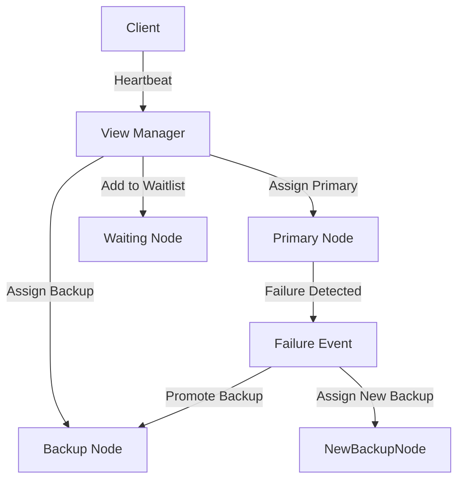

# View Management Service

## Overview
This project implements a **View Management Service** for a distributed key-value storage system, following a **Primary/Backup replication model**. The system ensures fault tolerance by detecting failures and automatically promoting backup nodes when necessary.

This service is **part 1** of a broader project, where part 2 will develop a fault-tolerant key-value store that relies on this view manager.

## Features
- Manages numbered views with a **Primary and a Backup**.
- Detects node failures through periodic **heartbeat messages**.
- Promotes a Backup to Primary upon failure detection.
- Maintains a waiting list for additional nodes.
- Ensures **state consistency** across node transitions.

## System Model

## How It Works
1. **Initialization**: The first node sending a heartbeat becomes the Primary.
2. **Adding a Backup**: When a second node appears, it is assigned as Backup.
3. **Failure Detection**: If the Primary fails, the Backup is promoted.
4. **Handling Waiting Nodes**: Extra nodes are kept in a waiting list and used as replacements if needed.
5. **Critical Failure**: If both Primary and Backup fail simultaneously, the system halts.
